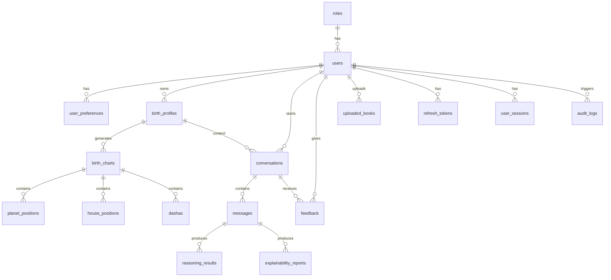

# Database Design

## Entity Relationship Diagram



## Tables

### `roles`

Role-based access control definitions.

| Column | Type | Notes |
|--------|------|-------|
| id | INTEGER | Primary key |
| name | VARCHAR(50) | Unique role name |
| description | VARCHAR(255) | Human-readable description |
| permissions | TEXT | Comma-separated permission list |

### `users`

Application user accounts.

| Column | Type | Notes |
|--------|------|-------|
| id | INTEGER | Primary key |
| email | VARCHAR(255) | Unique, indexed |
| name | VARCHAR(255) | Display name |
| hashed_password | VARCHAR(255) | Argon2id hash |
| role_id | INTEGER | FK to `roles.id` |
| is_active | BOOLEAN | Soft-enable flag |
| is_verified | BOOLEAN | Email verification flag |
| is_superuser | BOOLEAN | Full access |
| verification_token | VARCHAR(255) | Email verification token |
| reset_token | VARCHAR(255) | Password reset token |
| account_status | VARCHAR(50) | active, deleted, etc. |
| deleted_at | DATETIME | Soft-delete timestamp |
| created_at | DATETIME | Record creation |
| updated_at | DATETIME | Last update |

### `user_preferences`

Per-user settings and preferences.

| Column | Type | Notes |
|--------|------|-------|
| id | INTEGER | Primary key |
| user_id | INTEGER | FK to `users.id` (one-to-one) |
| preferred_language | VARCHAR(10) | Default `en` |
| preferred_explanation_depth | VARCHAR(50) | brief, balanced, detailed |
| preferred_astrology_school | VARCHAR(100) | parashari, etc. |
| preferred_chart_style | VARCHAR(50) | north_indian, south_indian |
| citation_mode | VARCHAR(50) | inline, footnote |
| dark_mode | BOOLEAN | UI preference |
| units | VARCHAR(20) | metric, imperial |
| notification_settings | JSON | Notification payload |
| timezone | VARCHAR(100) | Default `UTC` |
| country | VARCHAR(100) | Country code/name |
| theme_preference | VARCHAR(50) | system, light, dark |
| privacy_settings | JSON | Privacy payload |

### `birth_profiles`

A birth profile owned by a user (self, spouse, child, etc.).

| Column | Type | Notes |
|--------|------|-------|
| id | INTEGER | Primary key |
| user_id | INTEGER | FK to `users.id` |
| profile_name | VARCHAR(255) | e.g. Self, Spouse |
| relationship | VARCHAR(50) | self, spouse, child, etc. |
| date_of_birth | VARCHAR(50) | ISO date string |
| time_of_birth | VARCHAR(50) | ISO time string |
| birth_place | VARCHAR(255) | Place name |
| latitude | FLOAT | Decimal degrees |
| longitude | FLOAT | Decimal degrees |
| timezone | VARCHAR(100) | IANA timezone |
| accuracy_level | VARCHAR(50) | exact, approximate |
| notes | TEXT | Free-form notes |
| chart_metadata | JSON | Extra chart metadata |
| created_at | DATETIME | Record creation |
| updated_at | DATETIME | Last update |
| deleted_at | DATETIME | Soft-delete timestamp |

### `birth_charts`

A generated Vedic birth chart for a birth profile.

| Column | Type | Notes |
|--------|------|-------|
| id | INTEGER | Primary key |
| profile_id | INTEGER | FK to `birth_profiles.id` |
| chart_type | VARCHAR(50) | rashi, navamsa, etc. |
| chart_data | JSON | Complete chart JSON |
| generated_at | DATETIME | Generation timestamp |

### `planet_positions`, `house_positions`, `dashas`

Normalized chart sub-tables for planet positions, house data, and dasha periods.

| Table | Key Columns | Notes |
|-------|-------------|-------|
| planet_positions | birth_chart_id, planet, house, sign, nakshatra, dignity, retrograde, combust, degree | One row per planet |
| house_positions | birth_chart_id, house, sign, lord, planets | One row per house |
| dashas | birth_chart_id, planet, start_date, end_date, is_main, is_current | Dasha periods |

### `conversations`

A user conversation tied to a birth profile.

| Column | Type | Notes |
|--------|------|-------|
| id | INTEGER | Primary key |
| user_id | INTEGER | FK to `users.id` |
| birth_profile_id | INTEGER | FK to `birth_profiles.id` |
| title | VARCHAR(255) | Optional title |
| domain | VARCHAR(100) | marriage, career, etc. |
| summary | TEXT | Auto-generated summary |
| is_archived | BOOLEAN | Archive flag |
| is_deleted | BOOLEAN | Soft-delete flag |
| deleted_at | DATETIME | Soft-delete timestamp |
| created_at | DATETIME | Record creation |
| updated_at | DATETIME | Last update |

### `messages`

A single message within a conversation.

| Column | Type | Notes |
|--------|------|-------|
| id | INTEGER | Primary key |
| conversation_id | INTEGER | FK to `conversations.id` |
| role | VARCHAR(50) | user, assistant, system |
| content | TEXT | Message text |
| ai_response_json | JSON | Structured AI response |
| created_at | DATETIME | Timestamp |

### `reasoning_results`

Stored structured reasoning for a message.

| Column | Type | Notes |
|--------|------|-------|
| id | INTEGER | Primary key |
| conversation_id | INTEGER | FK to `conversations.id` |
| message_id | INTEGER | FK to `messages.id` |
| domain | VARCHAR(100) | Astrology domain |
| chart_data | JSON | Chart snapshot |
| matched_rules_json | JSON | Matching rules |
| supporting_evidence_json | JSON | Supporting evidence |
| conflicting_evidence_json | JSON | Conflicting evidence |
| overall_confidence | FLOAT | Final confidence |
| reasoning_summary | TEXT | Summary text |
| created_at | DATETIME | Timestamp |

### `explainability_reports`

Stored explainability reports for a message.

| Column | Type | Notes |
|--------|------|-------|
| id | INTEGER | Primary key |
| conversation_id | INTEGER | FK to `conversations.id` |
| message_id | INTEGER | FK to `messages.id` |
| report_data_json | JSON | Full XAI report |
| created_at | DATETIME | Timestamp |

### `feedback`

User feedback on an AI response.

| Column | Type | Notes |
|--------|------|-------|
| id | INTEGER | Primary key |
| user_id | INTEGER | FK to `users.id` |
| conversation_id | INTEGER | FK to `conversations.id` |
| message_id | INTEGER | FK to `messages.id` |
| rating | VARCHAR(50) | Very Helpful, Helpful, Neutral, Not Helpful, Incorrect |
| comment | TEXT | Free-form comment |
| response_text | TEXT | Snapshot of response |
| reasoning_trace_json | JSON | Reasoning trace |
| rules_used_json | JSON | Rules referenced |
| created_at | DATETIME | Timestamp |

### `uploaded_books`

Books uploaded by admins for ingestion.

| Column | Type | Notes |
|--------|------|-------|
| id | INTEGER | Primary key |
| user_id | INTEGER | FK to `users.id` |
| file_path | VARCHAR(512) | Server path |
| file_name | VARCHAR(255) | Original filename |
| title | VARCHAR(255) | Book title |
| author | VARCHAR(255) | Author |
| language | VARCHAR(50) | Language code |
| status | VARCHAR(50) | pending, processing, approved, rejected |
| book_metadata | JSON | Extra metadata |
| is_active | BOOLEAN | Active flag |
| created_at | DATETIME | Timestamp |

### `knowledge_versions`

Version history of knowledge rules.

| Column | Type | Notes |
|--------|------|-------|
| id | INTEGER | Primary key |
| rule_id | VARCHAR(100) | Rule identifier |
| version | VARCHAR(50) | Semantic version |
| created_at | DATETIME | Timestamp |
| modified_at | DATETIME | Last update |
| modified_by | VARCHAR(255) | Editor |
| approval_status | VARCHAR(50) | pending, approved, rejected |
| change_history | TEXT | Change notes |
| deprecated | BOOLEAN | Deprecated flag |

### `refresh_tokens`

Refresh tokens for JWT rotation.

| Column | Type | Notes |
|--------|------|-------|
| id | INTEGER | Primary key |
| user_id | INTEGER | FK to `users.id` |
| token_hash | VARCHAR(255) | SHA-256 hash |
| expires_at | DATETIME | Expiry |
| revoked_at | DATETIME | Revocation |
| created_at | DATETIME | Timestamp |

### `user_sessions`

User sessions for logout tracking.

| Column | Type | Notes |
|--------|------|-------|
| id | INTEGER | Primary key |
| user_id | INTEGER | FK to `users.id` |
| token_jti | VARCHAR(255) | Unique token JTI |
| ip_address | VARCHAR(50) | Client IP |
| user_agent | TEXT | Client UA |
| expires_at | DATETIME | Expiry |
| logged_out_at | DATETIME | Logout timestamp |
| created_at | DATETIME | Timestamp |

### `audit_logs`

Security and knowledge audit logs.

| Column | Type | Notes |
|--------|------|-------|
| id | INTEGER | Primary key |
| timestamp | DATETIME | Event timestamp |
| action | VARCHAR(100) | Action name |
| user_id | INTEGER | FK to `users.id` |
| reason | TEXT | Reason |
| affected_objects_json | JSON | Affected objects |
| metadata_json | JSON | Extra metadata |

## Indexes

All primary keys and foreign keys are indexed automatically. Additional indexes:

- `ix_users_email` on `users.email`
- `ix_roles_name` on `roles.name`
- `ix_refresh_tokens_token_hash` on `refresh_tokens.token_hash`
- `ix_user_sessions_token_jti` on `user_sessions.token_jti`
- `ix_knowledge_versions_rule_id` on `knowledge_versions.rule_id`

## Normalization

- Users and preferences are split into one-to-one tables.
- Birth chart sub-entities (planets, houses, dashas) are normalized into separate tables.
- Conversations and messages are normalized; soft deletes keep referential integrity.
- JSON columns store flexible, schema-light data (chart_data, metadata, reports) while core relational data stays normalized.

## Scalability

- The schema is compatible with SQLite for the MVP and PostgreSQL for production.
- Soft deletes and archival flags support data retention policies.
- Indexes on email, token hashes, and rule IDs support high-traffic lookup paths.

## Migrations

Migrations are managed with Alembic.

```bash
cd backend
alembic revision --autogenerate -m "Description"
alembic upgrade head
```

The initial migration is `backend/alembic/versions/f85818966903_initial_schema.py`.
